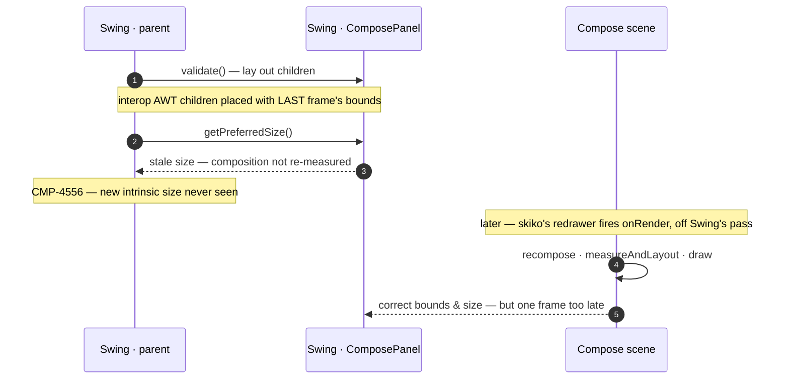
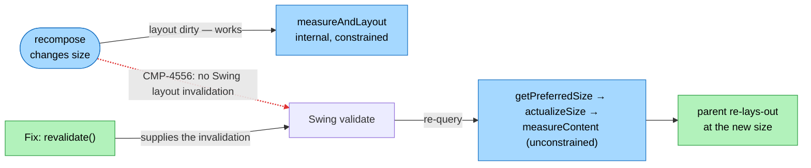
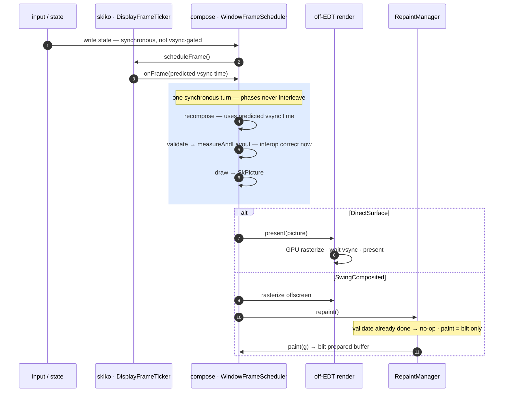
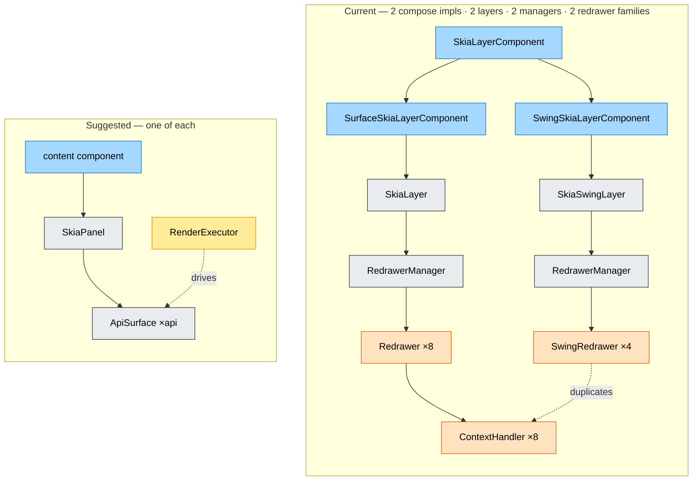
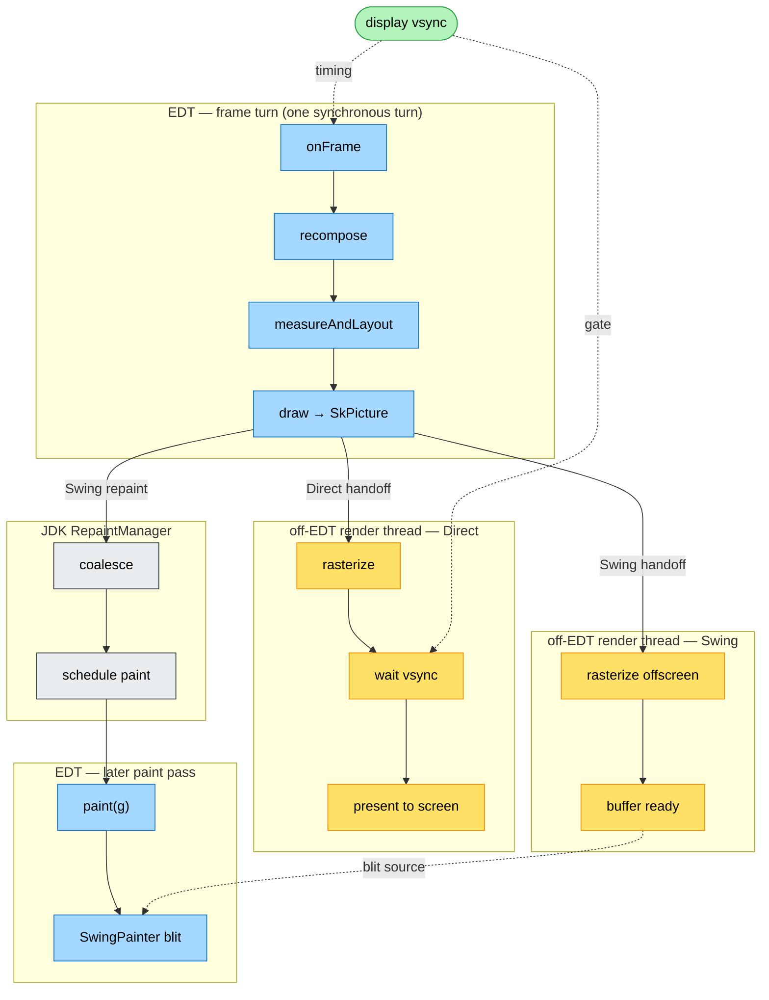

# Desktop frame phase-alignment — design doc

| | |
|---|---|
| **Status** | Design, ready to execute |
| **Scope** | Compose Multiplatform **desktop (JVM / Swing)** only |
| **Type** | Reshape of existing production code — not a rewrite |
| **Diagrams** | Inline Mermaid (renders in Obsidian / GitHub / IDEs) |

## TL;DR

On desktop, Compose's render runs *downstream of* Swing's layout/paint — produced inside skiko's `onRender`, **after** Swing's `validate`/`paint`. So within one frame Compose and Swing disagree; the irreducible symptom is **interop AWT children lagging a frame**. Some individual symptoms (e.g. CMP-4556's size reporting) are cheaply patchable on their own — but those are band-aids that don't make the frame consistent. This doc **aligns the two frames**: Swing drives, Compose's phases (recompose → layout → draw) run *inside* it, and skiko is reduced to presenting a ready picture. A shared, vsync-aligned **frame ticker** (skiko) drives one per-window scheduler (compose) that owns the recomposition clock. A secondary payoff: the same phase split introduces an `SkPicture` boundary that **unlocks off-EDT rasterization on the Swing-interop path** — a perf win that's structurally impossible today (§5.6).

---

## The shape — what we're building

Two things change; everything else is preserved.

**1. A frame driver on the compose side.** A **`WindowFrameScheduler`** — one per AWT root pane (stored as a root-pane client property) — owns one **`FrameRecomposer`** and subscribes to a skiko **`DisplayFrameTicker`** (shared, vsync-aligned, fires on the EDT). Its `onFrame(targetTime)` is one synchronous EDT turn: **recompose** → for each content component **`validate()`** (= `measureAndLayout`, so interop AWT children are positioned in-frame) → **`present()`** (= `scene.draw()` → `SkPicture`). Compose-initiated invalidations route through it (`revalidate`/`repaint`, branched on `isInFrame`); skiko's `needRender` driver is gone. This is Android's `Choreographer.doFrame`, transcribed onto Swing.

**2. skiko reduced to a presenter.** skiko stops bundling view + GPU context + frame loop into one class. `SkiaLayer`/`SkiaSwingLayer` are **kept and deprecated** (all platforms); their AWT role is taken by a **new `SkiaPanel`** — one component, `renderMode = DirectSurface | SwingComposited` — handed a ready `SkPicture` via **`present(picture)`**. Behind it: one per-API **`ApiSurface`** (unified GPU draw — subsumes the on-screen `*ContextHandler`s, deletes the duplicate offscreen `*SwingRedrawer` draw) and one shared **`RenderExecutor`** (off-EDT). skiko also exposes a cross-platform **render-context API** (rasterize a picture onto a *caller-owned* surface) and keeps **no platform view outside AWT**. On the compose side the two-impl **`SkiaLayerComponent` adapter collapses to one content component** over `SkiaPanel`. *(Full skiko-side plan — including the deprecation and the render-context API — is the companion doc, see §6.)*

**Net:** Swing drives the frame; Compose's phases run *inside* Swing's `validate`/`paint`; skiko just rasterizes and presents a picture. Interop becomes correct within one frame (CMP-4556 falls out for free), the renderer gets strictly simpler (a whole parallel per-API family is deleted, §5.5a), and the new `SkPicture` boundary lets Swing-path rasterization move off the EDT (§5.6). **Preserved unchanged:** input, IME, accessibility, drag-drop, transparency, popups/dialogs, and both render backends.

---

## 1. Why we need this



*Today Swing lays out and queries size **before** Compose renders (Compose runs later, in skiko's `onRender`). So interop child bounds and the intrinsic size are computed too late for this frame. The size part (CMP-4556) is cheaply patchable on its own (below); the **interop lag is not** — it needs Compose's layout to run inside Swing's `validate`. The reshape moves Compose's phases **into** that pass.*

**The structural problem.** Compose and Swing are two independent frame systems; Compose's frame is produced inside skiko's `onRender` (`ComposeSceneMediator.desktop.kt:726`), which fires **after** Swing's own `validate`/`paint`. Within one frame the two hold inconsistent state. The irreducible consequence — the one that **cannot** be patched without aligning the frames — is **interop AWT children lagging a frame**: their bounds come from Compose's layout, which runs after Swing has already validated.

**Could the most-cited symptom be fixed cheaper? Yes — and that's the honest point.** CMP-4556 (a `ComposePanel` not reporting intrinsic-size changes) does **not** need this reshape: invalidate Swing layout on content change (`revalidate()`) so the parent re-queries `getPreferredSize`, with an on-demand re-measure. A known dirty-fix does exactly that, and it's also the reshape's first, smallest slice (§8, C3). What the cheap fix does **not** buy is **single-frame consistency**: Compose's real layout — and interop child positioning — still runs later in `onRender`, after Swing's `validate`, so interop still lags and the two frames still disagree. Per-symptom band-aids accumulate; the reshape aligns the frames once. **So the justification is single-frame consistency / interop-in-frame — not CMP-4556, which the reshape merely fixes as a side effect.**

**The consequences, and which actually need the reshape:**

| Problem (today) | Evidence | Cheap standalone fix? | What the reshape gives |
|---|---|---|---|
| **Interop AWT children lag one frame** | bounds applied at render time in `onRender` (`ComposeSceneMediator.desktop.kt:727`), *after* Swing's layout; interop even re-fixes order afterwards (`SwingInteropContainer.desktop.kt:239-244`) | **No** — needs layout *inside* Swing's `validate` (the driver inversion); cf. Android `requestLayout()` (`AndroidComposeView.android.kt:1790-1817`) | `measureAndLayout()` in the content's `doLayout()` — interop positioned before `validateTree()` descends |
| **CMP-4556 — intrinsic size not reported** ([issue](https://youtrack.jetbrains.com/issue/CMP-4556)) | recompose never invalidates Swing layout → parent never re-queries `getPreferredSize → measureContent` (§3.2) | **Yes** — targeted `revalidate()` on content change (this *is* the C3 baseline) | subsumed for free by the invalidation split |
| **Two repaint authorities** | skiko `needRender` and Swing `RepaintManager` schedule independently → redundant / out-of-phase | **No** — collapsing two schedulers is behavioral | Compose's frame authoritative; `RepaintManager` reduced to the blit (§4.2) |
| **One frame clock per window** | every scene + popup builds its own `FrameRecomposer` (`:159`; layers `:107`, `:124`) → popups out of phase; snapshot-timing bug class | **No** — ownership change (line-157 TODO) | one shared recomposer per window (§4.4) |
| **EDT-bound rasterization (Swing) — a perf cost** | `SkiaSwingLayer` records + rasterizes + blits **all on the EDT** in `paint(g)`, fused (no `SkPicture`) (`MetalSwingRedrawer.kt`) | **Partial** — needs the same draw/rasterize *decoupling* the reshape introduces (a picture boundary to hand off) | the `SkPicture` boundary moves rasterize **off-EDT**, freeing the EDT during the heaviest step; `paint(g)` shrinks to a blit (§5.6, §8 C6) |

> Only **one** row is cheaply fixable in isolation (CMP-4556). The rest need the frames to actually run as one — which is the reshape. CMP-4556 is in the table as the cheaply-patchable contrast, not as a reason.

**Honest scope (when we *don't* need it).** A full-window, Compose-only app with **no interop** and fixed sizing is mostly fine today — single scene, one recomposer, skiko vsync, no Swing layout to integrate with. The value concentrates where Compose is **embedded in a Swing UI** (interop, `ComposePanel` inside layout managers, content-driven sizing), where **popups/dialogs** coexist, or where **EDT rasterization** stutters.

**Cost & verdict.** A multi-phase rewrite of the desktop frame spine + a new skiko API (§7, S1), re-entering known-dangerous territory (§9). The reshape earns its cost only if **single-frame consistency** matters — interop-in-frame, one clock, one repaint authority. If the product only needs a cheap symptom fix (e.g. CMP-4556's size reporting), ship that band-aid and skip this.

## 2. Goals & non-goals

**Goals**
1. Compose **layout synchronous inside Swing's `validate()`** → interop correct within one frame.
2. Swing-native invalidation (`revalidate`/`repaint`) replaces skiko's `needRender` driver.
3. A **shared vsync-aligned frame ticker** drives one per-window recomposition clock on the EDT.
4. Fix CMP-4556 (intrinsic-size reporting) as a first-class, tested outcome.
5. **Unlock off-EDT rasterization on the Swing path** (perf) via the `SkPicture` boundary the phase split introduces (§5.6, C6) — a payoff, not the justification.

**Non-goals (this reshape)**
- iOS / web frame-driving — only the *contract* is designed cross-platform; AWT lands (§7, S4).
- Dropping any existing capability — input, IME, accessibility, drag-drop, transparency, popups/dialogs are preserved.

## 3. How it works today (verified)

> Paths under `compose/ui/ui/src/desktopMain/kotlin/androidx/compose/ui/`. Android reference under `androidMain`. Swing internals verified in **JetBrainsRuntime** (`src/java.desktop/share/classes`).

### 3.1 The frame loop & invalidation
- **Both backends already record on the EDT** — the reshape's *driver inversion* moves no work between threads; it changes *who drives*. (The one deliberate thread move is a separable **perf** step, not a structural requirement: off-EDT Swing rasterization — §5.6, C6.)
  - **DirectSurface** (`SkiaLayer`): the redrawer's frame scheduler is `FrameDispatcher(MainUIDispatcher)` (= EDT); only GPU rasterize+present is off-EDT (`withContext(dispatcherToBlockOn)`), paced by `waitForVSync` (`MetalRedrawer.kt:197,203,119-126,208`).
  - **SwingComposited** (`SkiaSwingLayer`): `paint(g)` renders offscreen and blits to `Graphics2D` synchronously on the EDT (`MetalSwingRedrawer.kt:106-114`), driven by `RepaintManager`, no vsync.
- `SingleComposeSceneRenderingScope.render()` already runs `performFrame()` → `measureAndLayout()` → `draw()` in order inside one `onRender` (`SingleComposeSceneRenderingScope.kt:73`). *Desktop drops this class (§8, C2); other platforms keep it.*
- **Invalidation collapses:** `scene.invalidateLayout`/`invalidateDraw` → `mediator.onComposeInvalidation` → `needRender()` (debounced) → `skiaLayerComponent.needRender()`. Both fold into one `needRender` (TODO at `ComposeContainer.desktop.kt:457`).

> **Not "software vs GPU".** `SkiaSwingLayer` also rasterizes on the GPU (`createSwingRedrawer` picks `MetalSwingRedrawer`/`Direct3DSwingRedrawer`/`LinuxOpenGLSwingRedrawer` per OS, `SwingRedrawer.kt:41-44`). The real axis is the **present path**: direct on-screen surface + vsync vs offscreen + synchronous Java2D blit.

### 3.2 Sizing is two-directional — and the content→parent direction is broken (CMP-4556)



*Two measure paths exist. `recompose` updates the **internal** layout (top, works), but the **intrinsic-size report** to Swing (`getPreferredSize → measureContent`) only runs when Swing's layout is invalidated — which `recompose` never does (red edge = CMP-4556). The fix is one edge: `revalidate()` supplies that invalidation. **This is a cheap, standalone fix — it does not need the reshape** (it's the reshape's first slice, C3, but also shippable alone). It fixes the size **report**; it does not make interop positioning happen in the same frame — that's the part that needs the full alignment.*

- **Parent → content:** `ComposeContainer.setBounds → contentComponent.setSize` (`ComposeContainer.desktop.kt:391`); the content component's `doLayout()` → `onContainerSizeChanged()` sets `scene.size` (`ComposeSceneMediator.desktop.kt:696`). `ComposePanel.layout = null` (`ComposePanel.desktop.kt:104`) — content is sized manually, not by a `LayoutManager`.
- **Content → parent (intrinsic size):** `ComposePanel.getPreferredSize()` → `actualize()` → `ComposeContainer.actualizeSize()` → `measureContent(unconstrained)` → `scene.measureContent()` (`ComposePanel.desktop.kt:257`, `ComposeContainer.desktop.kt:242,228`, `ComposeSceneMediator.preferredSize/measureContent:379,391`). This is a **separate, unconstrained measure** — distinct from `measureAndLayout` (which lays out at the *assigned* bounds and positions interop) — used only to report intrinsic size to the Swing parent.
- **The break ([CMP-4556](https://youtrack.jetbrains.com/issue/CMP-4556)):** a recompose that changes intrinsic size does **not** invalidate Swing layout, so the parent never re-queries `getPreferredSize` → `measureContent` never re-runs → the panel never reports its new size. Scene-internal layout invalidation goes to `needRender` (skiko), bypassing Swing's `validate` entirely. (Calling `revalidate()` manually is unreliable — it depends on a parent layout manager re-querying the right component.)

### 3.3 Swing/AWT mechanics this relies on (JetBrainsRuntime)
- **Validate-then-paint order:** `RepaintManager.ProcessingRunnable.run()` clears queues, then `validateInvalidComponents()` **then** `prePaintDirtyRegions()` (`RepaintManager.java:1805-1820, 664-678`).
- **Validate-root bounds validation:** `addInvalidComponent` queues only the nearest `isValidateRoot()` ancestor (`RepaintManager.java:333-367`); `Container.invalidateParent()` stops upward `invalidate()` at a validate root under `isJavaAwtSmartInvalidate` (`Container.java:1582-1585`).
- **`validate()` never dequeues from `RepaintManager`:** a synchronous `validate()` makes the later `validateInvalidComponents()` a no-op **only because `isValid()` is then true** (`Container.java:1640-1643`) — load-bearing for §4.2.
- **No vsync on the EDT:** repaint is event-driven `invokeLater` coalescing — the vsync tick must come from skiko.

## 4. Target design (overview)



*One synchronous EDT turn (shaded), driven by the ticker. Input only schedules — it never waits for vsync. The phases run back-to-back, then the present **forks by backend**: direct-surface rasterizes/presents off-EDT at vsync; Swing-composited schedules a repaint whose `paint(g)` is reduced to a blit (validate already done).*

```
skiko DisplayFrameTicker (per display, vsync or FrameLimiter, fires on EDT) — created/owned by compose (§6.1)
        │ subscribe(listener) → onFrame(targetTimeNanos)   ·   scheduleFrame()
        ▼
WindowFrameScheduler (compose, one per root pane — §4.4)
  owns: shared FrameRecomposer · isInFrame flag · pendingLayout / pendingDraw sets
        │ onFrame(targetTimeNanos) — single synchronous EDT turn:
        │   1. recompose(targetTimeNanos)                 (frame time used HERE)
        │   2. for each content component: validate()     (sync layout; interop bounds in-frame)
        │   3. for each content component: present()      (scene.draw()→SkPicture → SkiaPanel.present)
        ▼
ComposePanel ── content component (one unified SkiaPanel; adapter removed — §5.1, §6)
        doLayout() → mediator.measureAndLayout()          (synchronous, in Swing validate)
        paint(g)   → blit the prepared buffer (Swing) · no-op (Direct)
```

### 4.1 The keystone

The desktop frame is **already phase-split and already records on the EDT** (§3.1). The reshape doesn't move work between threads — it changes *who drives*: Swing's `validate`/`paint` becomes the driver, and skiko is demoted to presenting a ready picture.

**Why this is sound: it's the model Android already ships.** `Choreographer.doFrame` drives the view traversal (`AndroidComposeView.dispatchDraw` *begins* with `measureAndLayout`, then draws) and the renderer just presents — host drives, Compose phases run inside, renderer presents. We are not inventing a frame model; we are adopting a production-proven one on the Swing host. The risk is in the *transcription* (Swing's `validate`/`paint` semantics, §3.3; the regression traps, §9), not in the model.

**What it unlocks beyond consistency:** demoting skiko to "present a ready `SkPicture`" introduces a picture boundary between *draw* and *rasterize*. On the Swing path those two are fused on the EDT today; the boundary lets rasterization move off-EDT (§5.6) — a perf win impossible without this restructure.

### 4.2 The frame, step by step

`onFrame` is one synchronous EDT turn. After recompose it **synchronously** runs validate (`doLayout`→`measureAndLayout`) and draw (`scene.draw()` → `SkPicture` → `SkiaPanel.present`) — but **not** the on-screen blit. It leaves a `repaint()` scheduled (Swing path); the later `RepaintManager` pass finds validate already done (no-op — §3.3) and `paint(g)` blits the prepared buffer. The EDT does the heavy work once; `RepaintManager` is reduced to the blit + interop composite. *(DirectSurface has no `RepaintManager`: the redrawer presents off-EDT at vsync.)*

```
WindowFrameScheduler.onFrame(targetTimeNanos):           // skiko DisplayFrameTicker, EDT
    frameRecomposer.performFrame(targetTimeNanos)          // recompose; frame time used HERE only
    for each content component (main + same-window layers):
        validateNow() → doLayout() → scene.measureAndLayout()    // sync; interop bounds
    for each content component:
        present() → scene.draw()=SkPicture → skiaPanel.present(picture, w, h)
    if (recomposer.hasPendingWork() || pendingLayout || pendingDraw) scheduleFrame()  // settle next frame
```

**No outer fixpoint loop.** Compose's `MeasureAndLayoutDelegate.measureAndLayout` already loops to a fixpoint internally before returning (`PlatformLayersComposeScene.skiko.kt:196`), so a single `validateNow()` brings layout fully current. Invalidations raised *after* the drain (e.g. the trailing `measureAndLayout` inside `draw()`, `BaseComposeScene.skiko.kt:169`) settle on the **next** frame — not via an unbounded in-frame `while` (which would spin on the per-phase `postponeInvalidation` re-firing).

### 4.3 Invalidation routing — branch on `isInFrame`

```
invalidateLayout = {
    if (scheduler.isInFrame) scheduler.captureLayout(content)   // defer to this frame's layout phase
    else { content.revalidate(); scheduler.scheduleFrame() }     // out-of-frame: Swing-native layout + frame
}
invalidateDraw = {
    if (scheduler.isInFrame) scheduler.captureDraw(content)
    else scheduler.scheduleFrame()                              // compose re-draws + presents next onFrame
}
```

**Why the `isInFrame` branch is mandatory.** Calling `content.revalidate()` *during* `onFrame`'s synchronous validate sets `valid=false` on the component whose `validateTree()` is still on the stack; when it finishes, `super.validate()` resets `valid=true`, **clobbering** it — and the entry left in `RepaintManager.invalidComponents` becomes a silent no-op, dropping the invalidation. So in-frame invalidations go **only** to the capture set; the synchronous drain handles them in phase order. (Mirrors the current `isRendering` guard in `SingleComposeSceneRenderingScope.kt:63-66`.) Scheduling is **always** compose (`WindowFrameScheduler.scheduleFrame()`), never a skiko `needRender`.

### 4.4 Ownership: one scheduler & recomposer per window (root-pane client property)

The `WindowFrameScheduler` is **stored as a client property on the AWT `JRootPane`** — `rootPane.putClientProperty(key, …)`, lazily resolved via `getClientProperty`, so every `ComposeContainer` under one root pane resolves the same instance. It owns one `FrameRecomposer` and creates/holds the skiko `DisplayFrameTicker`.

- **Same-window layers** (`OnComponent`/`OnSameCanvas` popups, `SwingComposeSceneLayer`): resolve the **same** scheduler + recomposer from the shared client property. `onFrame` recomposes once, then iterates the window's content components (main + layers) for validate, then present — all in the one EDT turn.
- **Separate-window layers** (`WindowComposeSceneLayer`, `OnWindow` — a distinct transparent AWT window for dialogs): today its mediator composes under the **owner's** recomposer (`compositionContext = mediator.frameRecomposer.compositionContext`, `ComposeContainer.desktop.kt:495`). But a separate AWT window has its **own** root pane → resolves its **own** scheduler/ticker. **Decision:** it shares the owner's `FrameRecomposer` (one recomposition graph) but is driven by its own window's ticker. Coordinating one clock across two windows on different displays is **open (S3)**.

## 5. Detailed design

### 5.1 Content component — the `SkiaLayerComponent` adapter collapses

Today `SkiaLayerComponent` is an **interface with two implementations** (`SurfaceSkiaLayerComponent`, `SwingSkiaLayerComponent`) whose only job is to adapt over skiko's two layer types — its own docstring says *"adapter to `SkiaLayer` or `SkiaSwingLayer`"*. `ComposeSceneMediator` consumes it as a pure façade: `contentRoot`, `hierarchyRoot`, `renderApi`, `interopBlendingSupported`, `clipComponents`, `transparency`, `fullscreen`, `windowHandle`, plus `needRender`/`renderImmediately`/`onRenderApiChanged` (all pass-throughs, `ComposeSceneMediator.desktop.kt:176-191,615-756`). The two impls differ only in (a) which skiko layer they wrap, (b) `contentRoot` = `canvas` vs `this`, and (c) a few mode-specific overrides (`doLayout`/`paint`/`getPreferredSize`/IME).

Unify skiko to **one** `SkiaPanel` that exposes `eventSurface` (= `canvas` for Direct, `this` for Swing) and those props directly, and the adapter has nothing left to abstract: **the interface and its two implementations are removed**, leaving **one** content component (a single `SkiaPanel` subclass) that carries the AWT overrides below. `mediator.contentRoot → skiaPanel.eventSurface`; `mediator.needRender → ` deleted (compose schedules); the rest become direct `SkiaPanel` properties.

> **Dependency on the skiko merge.** The new `SkiaPanel` is introduced in **SK0** (§6.4, companion skiko plan); C2 collapses the adapter onto it. `SkiaLayer`/`SkiaSwingLayer` stay in place, deprecated. Under the merge **fallback** (§6.2 — `SkiaPanel` keeps two thin internal variants sharing the present/timing core), the compose adapter still simplifies to one façade over the **shared** `eventSurface` + present API — the `needRender`/scheduling and `contentRoot`/`hierarchyRoot` plumbing collapse regardless — but a thin two-variant construction seam may remain inside `SkiaPanel`.

```
override fun doLayout() {
    super.doLayout()
    mediator.onContainerSizeChanged()    // scene.size from bounds
    mediator.measureAndLayout()          // SYNCHRONOUS — positions interop within this validate pass
}
override fun paint(g: Graphics) {         // this IS the unified SkiaPanel subclass
    mediator.onChangeDensity()           // preserve current density-check ordering
    super.paint(g)                       // Swing: blit prepared buffer (SwingPainter) · Direct: no-op
}
fun presentNow() {                       // the draw phase, called from onFrame
    val picture = scene.draw()           // produce SkPicture (no rasterize)
    present(picture, w, h)               // SkiaPanel.present: stores + rasterizes; Swing mode also repaint()s
}
```

No `Presenter{record, blit}` abstraction — compose hands a ready `SkPicture` to `SkiaPanel.present`; the Swing blit is `SkiaPanel.paint(g)` via the existing `SwingPainter`. The component never schedules frames itself.

### 5.2 `measureAndLayout` inside Swing validate + interop (no parent re-validate)

`doLayout()` runs `mediator.measureAndLayout()` synchronously, so a Swing validate of the content component lays out Compose and applies interop child bounds **before** `validateTree()` descends into them. Today interop application ends with `root.validate(); root.repaint()` on the **parent** `ComposePanel` (`SwingInteropContainer.desktop.kt:243`, `root = container = ComposePanel`). Calling `ComposePanel.validate()` from **inside the content child's** `validateTree()` re-enters the tree lock and re-validates the parent mid-pass. The reshape **must not** do that: interop bounds are set during the child's `measureAndLayout`; any parent escalation is the size-to-content path (§5.3), gated and out of the child pass.

### 5.3 The CMP-4556 fix (baseline) and the validate-root optimization (separable)

**Baseline — fixes CMP-4556, correct without any validate-root.** `invalidateLayout → content.revalidate()`. With the content component **not** under a validate root, `revalidate()` propagates up to the window (`JComponent.revalidate` = `invalidate` + `addInvalidComponent`, `JComponent.java:4909`): the Swing parent re-validates and re-queries `ComposePanel.getPreferredSize()` → `actualizeSize` → `measureContent` (§3.2), so a recompose that changes intrinsic size now surfaces. The correct, unoptimized behavior: **every** compose layout invalidation drives a full Swing layout pass. **Ship this first** — note this slice *is* the cheap standalone CMP-4556 fix (§1): it requires none of the rest of the reshape and fixes the size report on its own. The reshape's added value over it is single-frame consistency (interop-in-frame), not the size report.

**Optimization — `isValidateRoot`, separable, NOT required for correctness.** The baseline over-validates (whole Swing tree per change). `ComposePanel.isValidateRoot = true` would bound `revalidate()` to the content subtree (`Container.invalidateParent` stops at the root, `Container.java:1582`). **But the same bounding stops the upward propagation CMP-4556 needs when intrinsic size *does* change** — so the optimization must **escalate**: when `measureContent` reports a changed intrinsic size, deliberately invalidate `ComposePanel`/its parent; otherwise stay bounded. This mirrors Android's `scheduleMeasureAndLayout` choosing `invalidate()` (bounded) vs `requestLayout()` (escalate) (`AndroidComposeView.android.kt:1790-1817`). `ComposePanel.layout = null` means the validate-root never *relayouts* content (no layout manager); it is purely a **validation-scope** optimization. Convergence is **open (S2)** — see §7.

### 5.4 Non-Compose-initiated Swing layout/paint (host-driven, Android-grounded)

Compose owns only **recompose**; the host drives measure/layout/draw and Compose **pushes invalidations into it** — exactly Android. `AndroidComposeView.dispatchDraw` *begins* with `measureAndLayout()` then draws (`:2179,2183`); `onMeasure`/`onLayout` drive from the View side; `scheduleMeasureAndLayout` is the only bridge (`:1790-1817`); recompose runs separately. So a **Swing-initiated** `doLayout()`/`paint(g)` (resize, sibling relayout, damage/expose) runs `measureAndLayout()`/blit against the **current composition** — `measureAndLayout` is a no-op when clean, the blit reuses the cached buffer. No recompose, no special case. The capture-set + synchronous drain in `onFrame` exists only to give the *recompose-initiated* frame Android's single-`doFrame` ordering.

### 5.5 Renderer — structure & threading

**(a) What collapses — class structure.** Each box is one type; counts are instances; edges are ownership.



*Current is the complex side: `SkiaLayerComponent` + two impls (compose) over two skiko layers, two `RedrawerManager`s, and two parallel per-API redrawer families — `Redrawer ×8` (Metal/D3D/LinuxGL/WinGL/Angle/Software/DirectSoftware), each owning a `*ContextHandler` for the per-API GPU draw, and `SwingRedrawer ×4` (Metal/D3D/GL/Software) that **duplicate** that same draw inline. The reshape collapses all of it into one content component, one `SkiaPanel`, one per-API `ApiSurface` (which subsumes the `*ContextHandler` draw), and one shared `RenderExecutor`. **The net is a deletion, not a rename:** one whole parallel per-API family (`SwingRedrawer ×4` + its inline GPU draw) is removed outright; the other (`Redrawer`/`*ContextHandler`) becomes the shared `ApiSurface`. Renderer structure gets **strictly simpler**, and the new pieces (`DisplayFrameTicker`, `WindowFrameScheduler`) live on the frame-driving side, §4 — not here.*

**(b) How a frame runs — threads & vsync.** Lanes are threads. Solid = control flow; dashed = a signal or a data source, not a call. The frame fork (`Direct` / `Swing`) is two real edges, by `renderMode`.



*The whole frame turn (onFrame → recompose → measureAndLayout → draw) is **one synchronous EDT turn**; only rasterize/present leave the EDT. **Direct**: hands the picture to the render thread, which rasterizes, **waits the vsync edge**, and presents — no `RepaintManager`. **Swing**: rasterizes offscreen (off-EDT after C6; on-EDT before it) and posts `repaint()`; `RepaintManager` coalesces and schedules a **later EDT paint pass** whose `paint(g)` blits the ready buffer via `SwingPainter` — no vsync. Vsync feeds the Direct path twice: as **frame timing** into `onFrame` (the `outputTime` plumbing, §6.1/S1) and as the **present gate**.*

| | **DirectSurface** (`SkiaLayer`) | **SwingComposited** (`SkiaSwingLayer`) |
|---|---|---|
| Rasterize | GPU, **off-EDT** | GPU/software, into an **offscreen** surface |
| Present | direct on-screen surface | **synchronous Java2D blit** in `paint(g)` (`SwingPainter`) |
| Pacing | **vsync** (redrawer loop) | **`RepaintManager`** coalescing — no vsync |

**Frame timing — what is and isn't vsync-gated.**
- **Input is immediate, never vsync-gated** — `sendPointerEvent` runs synchronously on the EDT and only *schedules* a frame (`BaseComposeScene.skiko.kt:180-210`).
- **Recompose is not gated to the vsync edge** — the direct-surface loop records *before* `waitForVSync` (`MetalRedrawer.kt:203-208`); vsync only *paces*.
- **Predicted present time is NEW work, not an existing value.** macOS's CVDisplayLink callback *receives* `outputTime`, but skiko **discards** it (`displayLinkCallback` calls a no-arg `onVSync`; `waitVSync` returns `void` — `DisplayLinkThrottler.mm:42-47,175-197`). Exposing it is new native+JNI+Kotlin plumbing (part of S1). On the `FrameLimiter` path there is *no* present-phase anchor — best case is an estimate. **This doc does not assume animation-correct timing already exists.**

### 5.6 Performance — what the phase split unlocks

The reshape is justified by single-frame consistency (§1), but the same restructure buys real performance, concentrated on the **Swing-interop path** (`RenderSettings.SwingGraphics` / `SkiaSwingLayer`) — exactly the embedding scenario the consistency win targets.

**Off-EDT rasterization — impossible today, unlocked here.**
- **Today (Swing path):** `SkiaSwingLayer.paint(g)` → `SwingRedrawer.redraw(g)` does everything synchronously on the EDT — build a GPU surface, `renderDelegate.onRender` **records draw ops straight into that surface's canvas**, `flush` (GPU rasterize), then `SwingPainter` blit (`MetalSwingRedrawer.kt:94-114`). There is **no `SkPicture`**: record and rasterize are *fused*, so there is nothing to hand to another thread. The EDT is blocked for the whole GPU rasterize on every repaint; heavy or large surfaces stall input, scrolling, and any third-party EDT work.
- **After:** compose produces an `SkPicture` on the EDT (cheap — it records draw commands, no GPU), `ApiSurface.rasterize(picture)` runs `drawPicture`+`flush` **off-EDT** on the shared render thread (C6), and `paint(g)` shrinks to a `SwingPainter` blit. The EDT now spends only recompose + measureAndLayout + record + blit; the expensive GPU step runs concurrently.
- **The enabler is the keystone boundary (§4.1)** — "compose hands a ready picture to the presenter." Without the picture boundary there is no handoff; with it, off-EDT rasterization is a small, local step (C6). This is *why* the perf win can't be had cheaply in isolation: it needs the same draw/rasterize decoupling the reshape introduces.

**Honest limits (no overclaim).**
- The blit stays on the EDT. Metal is zero-copy (`AcceleratedSwingPainter`: wrap texture → `g.drawImage`); D3D/GL/software use `SoftwareSwingPainter` (`readPixels`, a VRAM→RAM copy) — cheaper than a full rasterize, not free.
- Recording the `SkPicture` is itself EDT work — less than rasterizing, but nonzero.
- No vsync is added to the Swing path; pacing stays `RepaintManager` coalescing. This removes the EDT *rasterize stall*, it does not add frame pacing.
- The Direct path is already off-EDT (§3.1) — unchanged; this win is Swing-path-specific.

**Secondary wins (from the alignment itself, not C6).**
- **One repaint authority** (§4.2): today skiko `needRender` and Swing `RepaintManager` both schedule → redundant / out-of-phase frames. After: compose's frame is authoritative, `RepaintManager` is reduced to the blit → fewer wasted frames.
- **One clock per window** (§4.4): today each scene/popup owns its own `FrameRecomposer` + frame loop, so a window with popups runs several uncoordinated loops. After: one recomposer drives all same-window content in one EDT turn → no duplicated per-popup frame work, and popups stay in phase.

## 6. The skiko frame API & code-move map

> **Skiko-side direction (refined) — see the companion plan: `skiko/docs/render-context-and-awt-frame-api-plan.md` (governs skiko naming).** The skiko work is **additive + deprecating**, not an in-place rewrite of `SkiaLayer`:
> - **`SkiaLayer`/`SkiaSwingLayer` are kept and `@Deprecated`** (all platforms) — *not* modified. Source-compatible, not binary.
> - **A new AWT `SkiaPanel`** (one component, `renderMode`) takes the presenter role below. Where this section says "`SkiaPanel`", that is the **new** type — not a modified `SkiaLayer`.
> - **A cross-platform render-context API** (rasterize a `Picture` onto a caller-owned surface) is the reusable primitive; **skiko exposes no platform view outside AWT** (macOS/iOS/web consumers own their surface).
> - The ticker is **`DisplayFrameTicker`** (§6.1).

**Net effect on skiko: this is a simplification, not added complexity.** Today there are two AWT layer classes, two `RedrawerManager`s, and **two parallel per-API redrawer families** (~8 on-screen `Redrawer`s — each owning a per-API `*ContextHandler` for the GPU draw — + ~4 offscreen `SwingRedrawer`s that **duplicate** that same per-API draw with no `ContextHandler`), each with its own frame loop (§5.5). The reshape collapses them into **one** `SkiaPanel`, **one** per-API `ApiSurface` family that subsumes the `*ContextHandler` draw (surface ops only), and **one** shared `RenderExecutor`. The genuinely new surface is small and lives on the *timing* side: the `DisplayFrameTicker` (§6.1) and the `outputTime` plumbing.

### 6.1 `DisplayFrameTicker` — skiko mechanism, compose ownership
`DisplayFrameTicker` is a **skiko** type (owns *how* to tick: vsync or `FrameLimiter`, predicted present time, EDT delivery, `scheduleFrame` coalescing/pause-resume). skiko does **not** decide how many exist or who shares them.

```kotlin
// skiko, awtMain — @ExperimentalSkikoApi
interface DisplayFrameTicker : AutoCloseable {
    fun subscribe(listener: FrameListener): AutoCloseable   // EDT callbacks
    fun scheduleFrame()                                     // coalescing; resumes if idle
}
fun interface FrameListener { fun onFrame(targetTimeNanos: Long) }
fun DisplayFrameTicker(component: java.awt.Component): DisplayFrameTicker  // CREATE only — no caching/sharing/ownership
```
Compose's `WindowFrameScheduler` creates, holds, shares (per root pane) and `close()`s it (§4.4). **Cross-platform:** the AWT `DisplayFrameTicker` is `awtMain`, but `FrameRecomposer`/`SingleComposeSceneRenderingScope` are `skikoMain`, and iOS (`CADisplayLink`/`OutOfFrameExecutor`) and web (`rAF`) already have frame sources — so the `onFrame`/`scheduleFrame` *contract* is designed platform-neutral; only AWT lands here (S4).

### 6.2 The new AWT `SkiaPanel` presenter (replaces `SkiaLayer`-awt + `SkiaSwingLayer`)

**Compose produces the `SkPicture`** (`scene.draw()` in `onFrame`); the new `SkiaPanel` is handed a ready picture and presents it. `SkiaLayer`/`SkiaSwingLayer` are kept and deprecated (not modified); `SkiaPanel` is the new AWT component.

```kotlin
enum class SkiaRenderMode { DirectSurface, SwingComposited }

class SkiaPanel(renderMode = DirectSurface) : JComponent {   // NEW — AWT only
    fun present(picture: Picture, width: Int, height: Int)  // STORE + rasterize + show a ready picture
    // NO needRender / no scheduling — frames are scheduled by compose (WindowFrameScheduler owns the ticker).
    // Damage/expose re-presents the STORED picture — Direct: redrawer redraws on HardwareLayer.paint;
    // Swing: paint(g) re-rasterizes/blits from the held picture — with NO compose round-trip.
    val eventSurface: java.awt.Component   // canvas (Direct) or this (Swing) — input target, a MODE concern
    override fun paint(g)                  // Swing: blit via SwingPainter · Direct: no-op
}
```

**Three present concerns are orthogonal; only the thread pool & ticker are shared:**

```kotlin
internal interface ApiSurface {          // per GraphicsApi (Metal/D3D/GL/sw) — the ONLY API-specific code
    fun rasterize(picture: Picture, w: Int, h: Int)   // surface.canvas.drawPicture(picture)
    fun present()                        // Direct: swap to screen · Swing: expose blittable
}
internal interface SwingPainter {        // Swing blit (ALREADY EXISTS in skiko) — Accelerated | Software
    fun paint(g: Graphics2D, surface: Surface, texture: Long)
}
```
- **`present(picture)` has no frame time, no `PictureHolder`, no `Graphics2D`.** Frame time is used only in `recompose`; the Swing `Graphics2D` blit is internal to `SkiaPanel.paint(g)`.
- **Present-time concerns** (today inside `SkiaLayer.update()`, `:594-643`): the transparency-aware `clear()` and the interop `cutoutFromClip` are **redrawer/AWT-state-dependent** and stay present-side — `ApiSurface.rasterize` does `clear(bg)` → cutout → `drawPicture`. (Compose must host a `PictureRecorder` to *produce* the picture — a new seam, since `BaseComposeScene.draw(canvas)` draws into a supplied canvas, `BaseComposeScene.skiko.kt:155`.)
- **Off-EDT thread is already shared** (`dispatcherToBlockOn`, one module-level cached pool). What's duplicated is each redrawer's *orchestration*; a single `RenderExecutor` drives `ApiSurface.rasterize`/`present` off that shared thread. **Pacing stays per-API/per-display** (Metal per-window CVDisplayLink; GL bespoke multi-monitor; D3D vsync fused into `swap()`) — it does **not** centralize.
- **Zero-copy blit is Metal-only** (`AcceleratedSwingPainter` is built only by `MetalSwingRedrawer`); D3D/GL/sw use `SoftwareSwingPainter` (`readPixels`). The accelerated path needs the native `texturePtr` exposed from `ApiSurface`.
- **`ApiSurface` *is* the existing per-API GPU work, consolidated — `*ContextHandler` folds into it.** Today the per-API GPU draw is **split**: the on-screen path uses a `*ContextHandler` (`JvmContextHandler(layer) : ContextHandler(layer, layer::draw)` — per-API context + draws the layer's stored picture; `MetalRedrawer` owns a `MetalContextHandler` and calls `contextHandler.draw()`), while the **offscreen Swing path duplicates** equivalent per-API surface/draw code inside each `*SwingRedrawer` (it does **not** use `ContextHandler`). `ApiSurface` is the single per-API GPU surface used by **both** present modes, so the `*ContextHandler` logic is reused as its substance and the offscreen per-API duplicate disappears. The reshape **removes the on-screen/offscreen duplication of per-API GPU code** — `*ContextHandler` is not added complexity, it's part of what's being unified.

**Merge mechanics — the hard part is the event surface.** The two render modes are *not* one component with a flag: today's `SkiaLayer` is a `JComponent` that adds a **heavyweight `HardwareLayer` Canvas child and redirects all focus/mouse/key/IME listeners to it** (`SkiaLayer.awt.kt:482-568`); `SkiaSwingLayer` is a lightweight `JPanel` that *is* its own event target. The new `SkiaPanel` exposes **`eventSurface`** (= canvas for Direct, = `this` for Swing) and routes input there — and compose already abstracts exactly this via `contentRoot`, so no new compose concept. **Build it in safe steps:** (1) factor a shared present/timing core; (2) introduce `eventSurface` + per-API `ApiSurface`; (3) split `present(picture)` from the redrawer loop; (4) land `SkiaPanel` with both modes; deprecate `SkiaLayer`/`SkiaSwingLayer` in place. **Fallback (S1):** if the event-surface unification resists, keep two thin internal `SkiaPanel` variants over the shared core (≈90% of the value). *(The deprecated `SkiaLayer`/`SkiaSwingLayer` stay source-compatible regardless — see companion skiko plan.)*

### 6.3 What moves where

**skiko**

| Today | Becomes |
|---|---|
| each redrawer's private `FrameDispatcher(MainUIDispatcher)` EDT loop | driven by the shared **`DisplayFrameTicker`** (per display, compose-owned) |
| native vsync edge discards `outputTime` (`DisplayLinkThrottler.mm:42-47`) | **new plumbing** to carry `outputTime` → `onFrame(targetTimeNanos)` |
| `SkiaLayer.update(nanoTime)` (record + clear + cutout) | **record removed** (compose produces the picture); clear + cutout move to present-time rasterize |
| `SkiaLayer.draw(canvas)` / `Redrawer` / `SwingRedrawer` | DirectSurface present / per-API `ApiSurface` + shared `RenderExecutor` |
| `*ContextHandler` (on-screen per-API draw) + the duplicated per-API draw inside `*SwingRedrawer` | unified into one per-API `ApiSurface` (drawPicture into the API surface), used by both present modes — removes the on-screen/offscreen duplication |
| `SkiaSwingLayer` + `SwingRedrawer` | `SwingComposited` `renderMode` of the new `SkiaPanel` |
| `renderDelegate` | dropped from the compose path (optional legacy adapter for other consumers) |

**compose-desktop**

| Today | Becomes |
|---|---|
| `FrameRecomposer` per mediator (`:159`) | one per window in `WindowFrameScheduler` on the root pane (C1) |
| `SingleComposeSceneRenderingScope` (desktop use) | removed; mediator drives phases directly |
| `onRender` (recompose+measure+draw in skiko callback, `:726`) | split: recompose → `onFrame`; `measureAndLayout` → content `doLayout()`; `scene.draw()`→present |
| `needRender()` + `DebouncingEdtExecutor` (`:679,411`) | `isInFrame`-branched routing (§4.3); **no `needRender` on the layer** — scheduling is compose-owned |
| `SkiaLayerComponent` **interface** + `Surface/SwingSkiaLayerComponent` (two impls) | **adapter removed** — collapses to **one** content component over the unified `SkiaPanel`; mediator façade pass-throughs become direct `SkiaPanel` props; `contentRoot → eventSurface` (§5.1) |
| interop `root.validate()` on parent (`SwingInteropContainer.desktop.kt:243`) | applied in the content's synchronous `measureAndLayout`, no parent re-validate (§5.2) |

### 6.4 Skiko-first: a behavior-preserving step (SK0)

**Yes — most of the skiko work can land *before* compose changes any behavior**, as internal refactor + additive API. This gives compose a cleaner, more flexible surface to migrate onto later, lands the renderer simplification (§5.5a) on its own schedule, and de-risks by separating the structural cleanup from the behavioral flip. It works because the per-API machinery is already `internal` — compose's only public touchpoints are `SkiaLayer`/`SkiaSwingLayer` + `renderDelegate` + `needRender`.

**Behavior-preserving — compose sees *no* change (pure internal refactor):**
- **Unify per-API GPU draw behind an internal `ApiSurface`.** The on-screen `*ContextHandler`s and the duplicated offscreen `*SwingRedrawer` draw both delegate to it. `ContextHandler`/`Redrawer`/`SwingRedrawer` are all `internal`, so compose's public API is untouched — yet this alone deletes the duplicate family (§5.5a).
- **Extract `RenderExecutor`** — the shared off-EDT orchestration (the thread pool `dispatcherToBlockOn` is *already* shared; only the per-redrawer loop is duplicated). Internal.
- **Extract the shared core** of `SkiaLayer`/`SkiaSwingLayer` (record / clip / contentScale). Both public classes stay as-is.

**Additive — new API, nothing in compose uses it yet:**
- **`present(picture: Picture)`** alongside the existing `renderDelegate.onRender(canvas)` record path. The `renderDelegate` path keeps working identically; `present` is the seam compose adopts in C4. (Internally, the old path can record into a picture and feed the same present pipeline — same pixels.)
- **`DisplayFrameTicker`** (interface + AWT impl) — exposed but driving nothing until compose subscribes (C4).
- **New `SkiaPanel`** introduced; `SkiaLayer`/`SkiaSwingLayer` kept and `@Deprecated` **as-is** (existing `object : SkiaSwingLayer(…)` still compiles because they're unchanged). *This carries the merge risk (the event-surface unification, §6.2) — gate it behind the §6.2 fallback; the dedup/executor/`present` parts above carry none.*

**What stays behavioral (compose side, later — cannot be skiko-only):** driving `onFrame` from the ticker, compose *producing* the picture, dropping `needRender`/`renderDelegate`. Those flip the frame driver and land in C3/C4.

So **SK0 ships first, independently, behavior-preserving**, realizing the renderer simplification and handing compose the new API. Compose then migrates onto it (C2/C4) at its own pace, and a final **SK2** cleanup drops the deprecated aliases + `renderDelegate` once nothing uses them.

## 7. Open questions (spikes)

- **S1 — skiko frame API + layer merge + predicted time** *(skiko)*: per-display ticker; fold `SkiaSwingLayer` into `SkiaLayer`; **new native+JNI plumbing for `outputTime`** (does not exist today). Trap: idle pause/resume reliability (the iOS CADisplayLink regression, §9).
- **S2 — size-to-content convergence** *(compose, §5.3)*: the escalation loop (`parent relayout → setSize → measureAndLayout → maybe resized → escalate`) needs a Swing-`LayoutManager`→Compose-`Constraints` mapping + a "size unchanged ⇒ stop" guard. **The baseline (full revalidate) is correct and ships without this**; the validate-root optimization waits on S2.
- **S3 — cross-window frame-clock coordination** *(compose, §4.4)*: a separate-window dialog shares the owner's recomposer but has its own ticker — who advances the single clock, with which `targetTimeNanos`.
- **S4 — cross-platform `DisplayFrameTicker`/scheduler convergence** *(follow-up)*: generalize the contract so iOS/web adopt it and `SingleComposeSceneRenderingScope` retires everywhere. Design the contract now; implement only AWT here.
- **Merge fallback** *(§6.2)*: if the `eventSurface` focus/IME redirection can't be expressed without mode-specific code, keep two thin internal `SkiaPanel` variants over the shared present/timing core rather than forcing one flat AWT class.

## 8. Execution plan

**Compose-desktop lane**
1. **C1 — Per-window `FrameRecomposer` holder** (`WindowFrameScheduler` on the root pane); main scene + same-window layers share it; still driven by today's `needRender`. *Behavior-preserving. Resolves line-157 TODO.*
2. **C2 — Collapse the `SkiaLayerComponent` adapter into one content component over the unified `SkiaPanel`; drop `SingleComposeSceneRenderingScope` on desktop.** Remove the two-impl interface; mediator façade → direct `SkiaPanel` props; mediator drives phases directly. *Behavior-preserving restructure. Dep: C1, SK0 (§6.4).*
3. **C3 — Phase/invalidation split (fixes CMP-4556).** `invalidateLayout → revalidate(content)` (**full propagation, no validate-root**) / `invalidateDraw → scheduleFrame`, both `isInFrame`-branched (§4.3); `measureAndLayout` into content `doLayout()` (sync); interop bounds without parent re-validate (§5.2). *Dep: C2.*
4. **C4 — Drive `onFrame` from the skiko ticker; compose produces the picture.** *Dep: SK0 + SK1 + C1–C3.*
5. **C5 — Validate-root optimization + size-to-content** (consume S2): `ComposePanel.isValidateRoot=true` to bound validation, with escalation on intrinsic-size change (§5.3). *Dep: C3 + S2.*
6. **C6 — Background rasterization** on the Swing path: move `present()` rasterize off-EDT into a stored buffer that `paint(g)` blits. *Before C6, Swing `present()` rasterizes on the EDT in `paint(g)` (as today).* *Dep: C4.*

**Skiko lane**
- **SK0 — behavior-preserving refactor + additive API (§6.4; full detail in the companion skiko plan).** Internal `ApiSurface` dedup + `RenderExecutor` + shared-core extraction; additive `present(picture)`, `DisplayFrameTicker`, and the new `SkiaPanel`; `SkiaLayer`/`SkiaSwingLayer` kept and deprecated in place. **No compose change — ships first, independently; de-risks everything downstream.**
- **SK1 — `outputTime` native plumbing** into `DisplayFrameTicker` (the new native+JNI work, S1). Additive.
- **SK2 — cleanup after compose migrates:** drop the deprecated aliases + `renderDelegate` once nothing uses them. *Dep: C4.*

Land **SK0 first** (skiko-only, behavior-preserving). Then **C1 → C2 → C3** adopt it against today's `needRender`, in parallel with **SK1** (the long pole); **C4** integrates ticker-driven `onFrame` + compose-produced picture; **SK2** cleans up.

## 9. Risks (regression traps from prior reshape work)
- **Desktop detach density NPE** — frame/apply-timing changes re-expose the missing `isShowing` guard in `convertLocalToWindowPosition`; breaks `detachAndReattach`.
- **GlobalSnapshotManager deadlock** — `FrameRecomposer` holds the GSM registration; an inline apply pump can deadlock `sendApplyNotificationsFromNonUiThread`.
- **Split-phases invalidation pitfall** — per-phase `postponeInvalidation` re-fires invalidations that look like real work; the capture sets must not spin spurious frames (§4.2).
- **Ticker pause/resume** — the iOS CADisplayLink unreliable-resume trap (S1).

## 10. Verification
Keep green: `ComposePanelTest`, `ComposeWindowTest`, `ComposeDialogTest`, interop, popup/dialog, `RenderingTest`, `detachAndReattach`. New coverage by phase:
- **C3:** **CMP-4556** repro green (recompose changes content height → parent re-lays-out); interop bounds correct within one frame; `RepaintManager` validate becomes a no-op after `onFrame`; no in-frame `revalidate()` clobber; no unbounded layout spin.
- **C5:** content-only invalidation (intrinsic size unchanged) does **not** validate the whole Swing tree; size-to-content escalation still surfaces (optimization preserves the C3 fix).
- **C6:** Swing-path EDT time per frame drops (GPU rasterize no longer on the EDT — measure `paint(g)` duration on a heavy scene before/after); Swing interop output unchanged (golden-image parity); no tearing/blank-frame from the off-EDT handoff.

---

## Appendix — design provenance

This design was hardened by an adversarial cross-review against skiko, compose-desktop, and JetBrainsRuntime, then by concrete grounding in CMP-4556. Key corrections baked in above: predicted present time is *new* work (not existing); no single shared present orchestration (pacing is per-display); `ComposePanel.layout = null` makes the validate-root an *optimization*, not the correctness mechanism; in-frame routing must branch on `isInFrame` (clobber bug); `SkiaLayer.needRender` removed (scheduling is compose-only); interop cutout + clear are present-time; zero-copy blit is Metal-only. The CMP-4556 baseline-vs-optimization split (full revalidate ships first; validate-root behind S2) reflects that the simple full-revalidate path is the correct foundation.

*Diagrams are inline Mermaid — editable in place; they render in Obsidian, GitHub, and most IDEs.*
