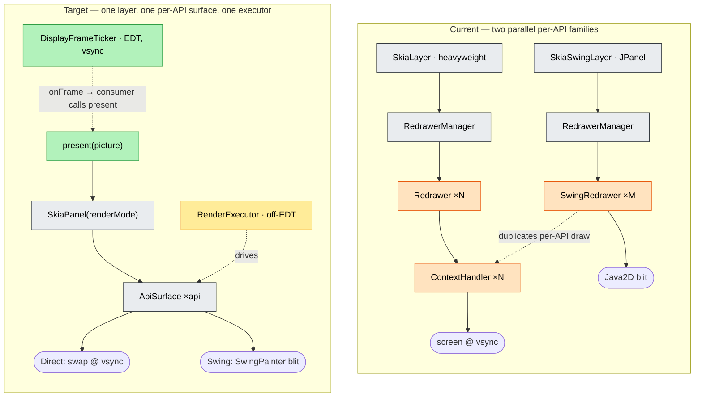
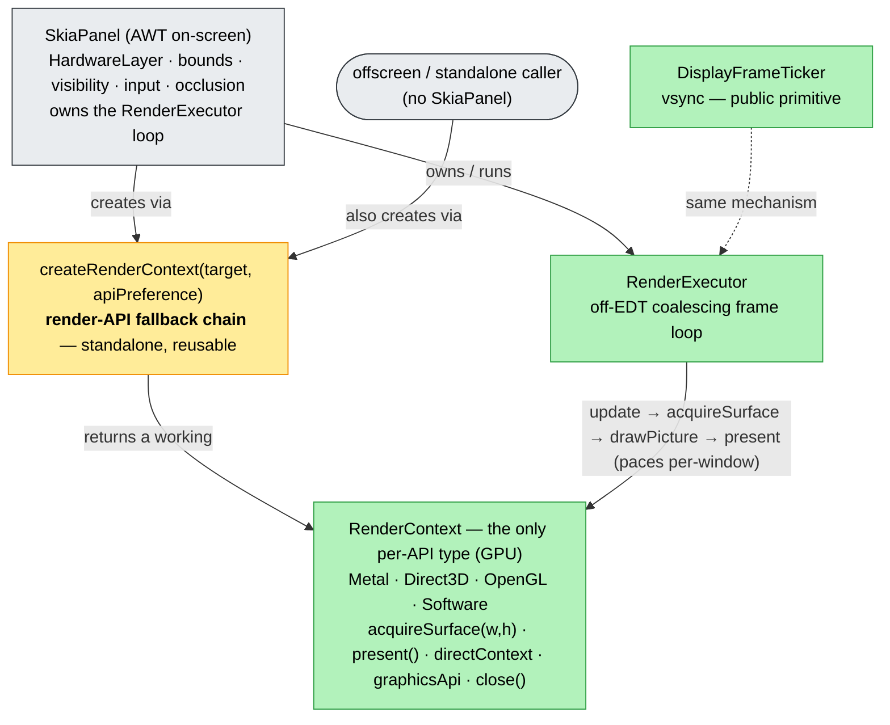
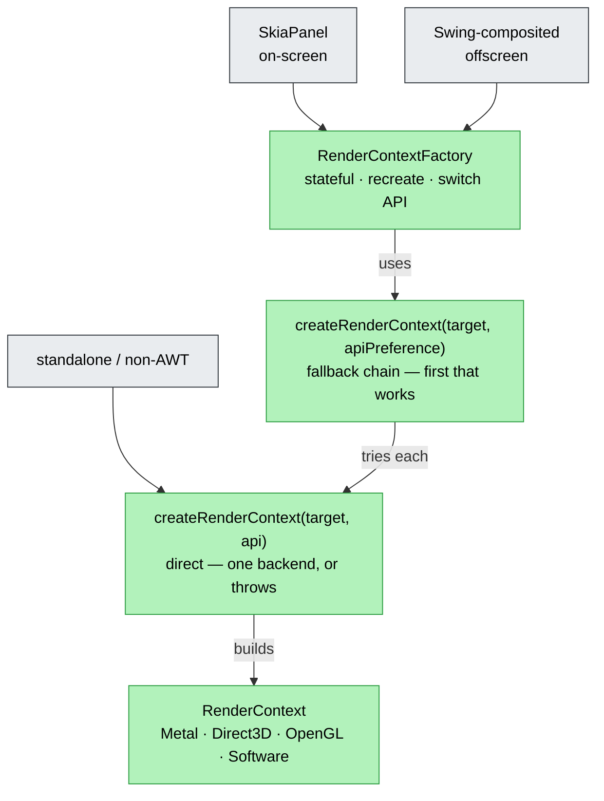

# skiko — render-context API, AWT `SkiaPanel` & frame ticker (implementation plan)

| | |
|---|---|
| **Status** | Design, ready to execute in skiko |
| **Scope** | skiko: a cross-platform **render-context** API + **AWT-only** `SkiaPanel`/`DisplayFrameTicker` |
| **Type** | Additive new API + internal unification; **`SkiaLayer` kept and deprecated**, not removed here |
| **Compatibility** | **Source-compatible, not binary.** Consumers recompile. No removals in this plan. |
| **Self-contained** | Yes — executable inside the skiko repo with no external context. (A consumer driving this is Compose Multiplatform, but nothing here depends on it.) |

> Names in this doc (`SkiaPanel`, `DisplayFrameTicker`, `RenderContext`, `RenderTarget`, `ApiSurface`, `RenderExecutor`) are **proposals** — pick the final names when implementing.

## TL;DR — what we build

`SkiaLayer` today bundles three unrelated concerns into one cross-platform class: a **GPU render context**, a **platform view**, and a **frame loop**. That bundling forces a parallel offscreen rendering family, blocks consumers that already own a surface from reusing skiko's GPU path, and hides the vsync frame source. We split the three:

1. **Deprecate `SkiaLayer`** — public API unchanged, `@Deprecated` on **all** platforms (it is `expect`/`actual` across android/awt/linux/macos/web/uikit).
2. **Expose a public render-context API** (cross-platform): create a skiko GPU context + target surface bound to a **caller-supplied drawable**, rasterize a `Picture`, present/flush. This is the reusable primitive. **skiko stops exposing a platform "view" outside AWT** — on macOS/iOS/web the consumer wires its own `CAMetalLayer`/`NSView`/`<canvas>` to this API (it already owns those).
3. **AWT only — two new types:** **`SkiaPanel`** (one component unifying `SkiaLayer`-awt + `SkiaSwingLayer`, built on the render-context API) and **`DisplayFrameTicker`** (the shared, vsync-aligned frame source with predicted present time). AWT is special: Swing interop needs a real heavyweight/lightweight component, so skiko keeps providing the view *there only*.

## 0. Decisions baked into this plan

- **Do not modify `SkiaLayer`.** Keep its API; mark it `@Deprecated` everywhere with `ReplaceWith` → `RenderContext` (non-AWT) / `SkiaPanel` (AWT).
- **skiko's cross-platform contribution = render-context creation + picture rasterization.** No platform view component outside AWT.
- **View ownership on web/macOS/iOS moves to the consumer.** Verified low-friction: those consumers already hold the platform surface.
- **New, AWT-only:** `SkiaPanel`, `DisplayFrameTicker`.
- **Compatibility:** source-compatible, not binary.

## 1. Why (skiko-internal motivation, standing on its own)

1. **`SkiaLayer` conflates three concerns.** It is (a) a GPU context owner (delegates to `ContextHandler`), (b) an AWT/native view (heavyweight `HardwareLayer` + listener redirection on awt; platform views on macos/uikit/web), and (c) a frame loop (each redrawer runs a private `FrameDispatcher`). A consumer that already has a surface cannot reuse (a) without dragging in (b) and (c).
2. **Two parallel per-API GPU families.** On-screen rendering uses `ContextHandler` (per-API GPU surface that draws the layer's recorded `Picture`); offscreen Swing rendering **duplicates** the equivalent per-API surface code in `SwingRedrawerBase`/`*SwingRedrawer` with **no** `ContextHandler` and **no** `Picture`. Same GPU draw, written twice.
3. **No reusable context primitive.** There is no public "rasterize this `Picture` onto my surface" entry point — you must instantiate a `SkiaLayer`.
4. **Frame source is hidden and lossy.** Each redrawer owns a private `FrameDispatcher(MainUIDispatcher)` loop; the predicted present time the OS already provides (`outputTime`) is **discarded** (§5).

## 2. Current architecture (verified, with paths)

> skiko root: `skiko/src/…`. AWT code in `awtMain`; per-API GPU contexts in `commonMain`/`awtMain` `context/`; offscreen Swing in `awtMain` `swing/`.

- **`SkiaLayer`** — `expect` in `commonMain/…/SkiaLayer.kt`, actuals in `androidMain/awtMain/linuxMain/macosMain/webMain/uikitMain`. AWT actual (`SkiaLayer.awt.kt`): `actual open class SkiaLayer internal constructor(properties, renderFactory, analytics, pixelGeometry, …)`. Heavyweight — adds a `HardwareLayer` Canvas child (`backedLayer`/`canvas`) and **redirects focus/mouse/key/IME listeners to it** (`:482-568` region). **Already records a `Picture`:** `pictureRecorder`/`picture: PictureHolder?`; `update(nanoTime)` → `renderDelegate.onRender(canvas,…)` into the recorder → `PictureHolder` (`:594-643`); `internal fun draw(canvas)` draws the stored picture (`:674`). Public API: `renderDelegate`, `renderApi`, `transparency`, `fullscreen`, `contentScale`, `canvas`, `windowHandle`, `clipComponents`, `needRender()`, `renderImmediately()`, `attachTo()`, `detach()`.
- **`Redrawer`** — `commonMain/…/redrawer/Redrawer.kt`, `internal interface { dispose; needRender(throttledToVsync); renderImmediately; syncBounds; update(nanoTime); setVisible; renderInfo; isTransparentBackgroundSupported }`. On-screen family (`awtMain/redrawer/`): `MetalRedrawer`, `Direct3DRedrawer`, `LinuxOpenGLRedrawer`, `WindowsOpenGLRedrawer`, `AngleRedrawer`, `SoftwareRedrawer`, `AbstractDirectSoftwareRedrawer` — **each owns `private val contextHandler = XxxContextHandler(layer)`**, runs a private `FrameDispatcher(MainUIDispatcher)` loop, rasterizes off-EDT via `withContext(dispatcherToBlockOn)` paced by `waitForVSync` (e.g. `MetalRedrawer.kt:104-126,197-208`); `performDraw` calls `contextHandler.draw()` (`:150`).
- **`ContextHandler`** — `commonMain/…/context/ContextHandler.kt`, `internal abstract class ContextHandler(layer, drawContent: Canvas.()->Unit)`. Owns `DirectContext`/`BackendRenderTarget`/`Surface`/`Canvas`; `draw()` = `initContext()` → `initCanvas()` → `clear` + `drawContent()` (= `layer::draw`, the picture) → `flush()`. Subtree: `JvmContextHandler` → `ContextBasedContextHandler`/`ContextFreeContextHandler` → per-API (Metal/D3D/OpenGL/Angle/Software/DirectSoftware). **This is the per-API GPU surface — the seed of `RenderContext`/`ApiSurface`.**
- **`SkiaSwingLayer`** — `awtMain/swing/SkiaSwingLayer.kt`, `@ExperimentalSkikoApi open class : JPanel`. Lightweight, **is its own event surface**; `paint(g)` → `redrawer.redraw(g as Graphics2D)`; `RedrawerManager<SwingRedrawer>`.
- **`SwingRedrawer`** — `awtMain/swing/SwingRedrawer.kt`, `internal interface { dispose; redraw(g: Graphics2D) }`. `SwingRedrawerBase` does everything **synchronously on the EDT**: init context → `initCanvas` → `onRender` (renderDelegate records **straight into the surface canvas** — no `Picture`) → `flush` blits onto `Graphics2D`. Per-API offscreen family: `MetalSwingRedrawer`/`Direct3DSwingRedrawer`/`LinuxOpenGLSwingRedrawer`/`SoftwareSwingRedrawer`. Blit via `SwingPainter`: `AcceleratedSwingPainter` (Metal zero-copy — JBR `SharedTextures` wrap → `g.drawImage`) vs `SoftwareSwingPainter` (`readPixels` → `BufferedImage`).
- **`RedrawerManager<R>`** — `awtMain/…/redrawer/RedrawerManager.kt`, generic holder + render-API fallback chain (`findNextWorkingRenderApi`).
- **Shared off-EDT pool:** `dispatcherToBlockOn` (`DispatcherToBlockOn.kt`) — one module-level cached pool (already shared). **vsync:** `MetalVSyncer` / `DisplayLinkThrottler` (CVDisplayLink). `MainUIDispatcher` = EDT. `FrameLimiter` for non-vsync.



## 3. Target — three public pieces

### 3.1 Render-context API (cross-platform) — the reusable primitive

Promote `ContextHandler` to a **public, view-decoupled** API: given a caller-supplied drawable target, create a skiko GPU context + surface, hand back a `Canvas`, and rasterize/flush/present. Sketch (final shape is the implementer's):

```kotlin
// skiko commonMain (+ per-API actuals) — @ExperimentalSkikoApi
interface RenderContext : AutoCloseable {
    val canvas: Canvas                       // draw target for this frame
    fun rasterize(picture: Picture)          // canvas.drawPicture(picture) + clip/clear handling
    fun flush()                              // submit GPU work
    fun present()                            // swap/expose where the API presents; else no-op
}

// the caller owns the drawable; skiko binds a context to it:
sealed interface RenderTarget                // window handle / Metal layer / GL context / software buffer
expect fun createRenderContext(target: RenderTarget, api: GraphicsApi /*, size, props */): RenderContext
```

- **`RenderTarget`** is the consumer's drawable. On macOS/iOS the consumer passes its `CAMetalLayer`/Metal device; on web its `<canvas>`/WebGL context; on AWT `SkiaPanel` supplies the heavyweight/offscreen target internally.
- Per-API actuals = today's `ContextHandler` subclasses (Metal/D3D/GL/Software), **decoupled from `SkiaLayer`** (parameterized by `RenderTarget` + size instead of `layer`).
- **This is what non-AWT consumers use directly** — no skiko view. It is the single home of per-API GPU draw (the on-screen/offscreen duplication collapses into it).

### 3.2 `SkiaPanel` (AWT only) — the unified component

Replaces `SkiaLayer`-awt **and** `SkiaSwingLayer` with one AWT component carrying a render mode:

- **`DirectSurface`** — heavyweight, on-screen GPU surface, vsync present (today's `SkiaLayer` path).
- **`SwingComposited`** — lightweight `JPanel`, offscreen rasterize + Java2D blit (today's `SkiaSwingLayer` path).

Built on §3.1 + an internal `RenderExecutor` (§4) + `DisplayFrameTicker`. Push API `present(picture)`; the event-surface choice (heavyweight canvas vs `this`) is an **AWT-internal** concern, not a cross-platform export. AWT is the one platform where skiko still owns a view, because Swing interop requires a real component.

### 3.3 `DisplayFrameTicker` (AWT only) — the frame source *(rename of "FrameTicker")*

```kotlin
// skiko awtMain — @ExperimentalSkikoApi
interface DisplayFrameTicker : AutoCloseable {
    fun subscribe(listener: FrameListener): AutoCloseable   // EDT callbacks
    fun scheduleFrame()                                     // coalescing; resumes from idle
}
fun interface FrameListener { fun onFrame(targetTimeNanos: Long) }
fun DisplayFrameTicker(component: java.awt.Component): DisplayFrameTicker   // CREATE only
```

- vsync where available (`MetalVSyncer`/CVDisplayLink/…) else `FrameLimiter`; predicted present time from `outputTime` (§5).
- **Standalone** — not owned by `SkiaPanel`. A consumer owns/shares it (e.g. one per display) and decides sharing policy; skiko only provides the mechanism.

## 4. Internal unification (shared core)

- **`ApiSurface`** = the §3.1 render-context actuals, reused as `SkiaPanel`'s per-API GPU surface. Routing by mode: `DirectSurface` → `present()` swaps the on-screen surface; `SwingComposited` → rasterize into an offscreen surface, then `SwingPainter` blit in `paint(g)`. **The offscreen `SwingRedrawerBase` per-API duplicate is deleted** — both modes go through the one surface.
- **`RenderExecutor`** = one shared off-EDT orchestration driving `ApiSurface.rasterize`/`present` off the already-shared `dispatcherToBlockOn`, replacing each redrawer's private `FrameDispatcher` loop. **Pacing stays per-API/per-display** (Metal per-window CVDisplayLink; GL bespoke multi-monitor; D3D vsync fused into `swap()`) — `RenderExecutor` schedules, the per-API surface paces.
- **Present-time concerns stay present-side:** the transparency-aware `clear()` and interop `cutoutFromClip` are AWT/redrawer-state-dependent → they live in `ApiSurface.rasterize` (`clear(bg)` → cutout → `drawPicture`), not in the supplied `Picture`.

## 5. `outputTime` plumbing (the one native task)

Today `displayLinkCallback(CVDisplayLinkRef, const CVTimeStamp *now, const CVTimeStamp *outputTime, …)` (`awtMain/objectiveC/macos/DisplayLinkThrottler.mm:42`) **receives** `outputTime` but calls the no-arg `[throttler onVSync]` (`:45`); `waitVSync` (`:181`, JNI `:269`) returns `void` → **`outputTime` is discarded**. Thread it through: `displayLinkCallback` → `onVSync(outputTime)` → `waitVSync`/JNI → Kotlin, convert `CVTimeStamp`→nanos, surface as `DisplayFrameTicker.targetTimeNanos`. On the `FrameLimiter` path there is no hardware anchor — estimate. **New work** (native + JNI + Kotlin).

## 6. Steps (ordered, skiko-isolated)

| Step | Change | Risk |
|---|---|---|
| **K1** | Decouple `ContextHandler` from `SkiaLayer` → public **`RenderContext`** (§3.1), parameterized by `RenderTarget`+size. On-screen redrawers delegate to it. *Behavior-preserving internal refactor.* | low |
| **K2** | Extract **`RenderExecutor`** (§4): one shared off-EDT driver; redrawers become rasterize/present + pacing. *Behavior-preserving.* | low |
| **K3** | Route the offscreen Swing path through `RenderContext`/`ApiSurface` + `SwingPainter`; **delete the per-API offscreen duplicate** in `SwingRedrawerBase`/`*SwingRedrawer`. *Behavior-preserving (same pixels).* | med |
| **K4** | Build **`SkiaPanel`** (AWT) on `RenderContext` + `RenderExecutor`, both render modes; add `present(picture)` (push) beside the recorded path (pull). *Additive.* | med |
| **K5** | Add **`DisplayFrameTicker`** (interface + AWT impl, no `outputTime` yet). *Additive.* | low |
| **K6** | **Deprecate `SkiaLayer` + `SkiaSwingLayer`** on all platforms (`@Deprecated`, `ReplaceWith` → `RenderContext` / `SkiaPanel`). *Source-compatible.* | low |
| **K7** *(=SK1)* | `outputTime` native plumbing → `DisplayFrameTicker.targetTimeNanos` (§5). *New native.* — the long pole. | high |

**Open choice (resolved in §6.5).** Originally: reimplement on the new core so `Redrawer`/`ContextHandler` can be deleted, *vs* leave them. Resolved → **delete them**, but expressed as the clean primitive composition in §6.5 — *not* by gluing the legacy classes together (an attempt to do that via `MetalRedrawer extends ContextBasedContextHandler` was wrong and reverted).

## 6.5 AWT on-screen architecture (proposal — rev 2, not implemented)

`RenderContext` is **the only per-API type**, and it knows nothing about AWT. `SkiaPanel` owns the on-screen AWT concerns and composes the primitives. The render-API fallback chain is a **standalone factory**, reusable off-screen and with no `SkiaPanel` at all.



**Boundaries:**

- **`RenderContext` (per-API GPU) — reusable, AWT-agnostic.** One type, used on-screen, offscreen, and standalone. No `resize`/`setVisible`/`pace` on it — size arrives via `acquireSurface(w,h)`. An on-screen impl is created from `SkiaPanel`'s drawable (`createRenderContext(awtTarget)`) and reads geometry/scale from that target each frame, so window-tracking is an internal impl detail, not a method and **not a separate `OnscreenRenderContext` type** (that was unnecessary).
- **`SkiaPanel` owns every on-screen AWT concern** — heavyweight `HardwareLayer`, bounds/layout, content scale, visibility, input, occlusion — and owns the `RenderExecutor` loop. Per frame: `update → acquireSurface(currentSize) → drawPicture → present`. AWT resize → render at new size; hidden/occluded → pause the loop.
- **The fallback chain is standalone** (`createRenderContext(target, apiPreference)`): tries the API order, returns the first working `RenderContext` or throws — usable offscreen and without `SkiaPanel`. (This is `RedrawerManager.findNextWorkingRenderApi` promoted to the factory layer.)
- **`RenderExecutor`** — off-EDT coalescing loop; `SkiaPanel` owns one. **Pacing is per-window (option b, chosen)** — each `SkiaPanel` paces its own loop; the static cross-window GL dispatcher is dropped.
- **`DisplayFrameTicker`** — the public vsync primitive (consumers owning their own view); same `RenderExecutor` mechanism.

**Deleted:** `Redrawer` + all `*Redrawer`; `ContextHandler` + all `*ContextHandler` (they *become* the per-API `RenderContext` impls); `RedrawerManager`; `RenderFactory`.

| legacy | → target home |
|---|---|
| `*ContextHandler` (GPU) | the per-API `RenderContext` impl (it *is* the `RenderContext`) |
| `*Redrawer` device-from-`windowHandle` + present/swap | the per-API on-screen `RenderContext` impl, via `createRenderContext(awtTarget)` |
| `*Redrawer` `syncBounds`/`setVisible` (geometry/visibility) | `SkiaPanel` (owns the AWT peer); the impl reads geometry from its target — no method on the type |
| `*Redrawer` frame loop | one `RenderExecutor` in `SkiaPanel` |
| `*Redrawer` vsync wait / occlusion | per-window pacing in the loop (b); occlusion → `SkiaPanel` pauses |
| `RedrawerManager` fallback chain | standalone `createRenderContext(target, apiPreference)` |
| `RenderFactory` (test seam) | the same factory (injectable) |

**Naming:** per-API impls `MetalRenderContext` / `Direct3DRenderContext` / `OpenGLRenderContext` / `SoftwareRenderContext` (awtMain). The AWT on-screen Metal impl and the macOS-native `MetalRenderContext` (darwinMain) are different source sets / targets, so no compile clash; if explicit disambiguation is wanted, qualify by package rather than reintroducing an `Onscreen` type. `RenderTarget` = the drawable (AWT heavyweight surface · `CAMetalLayer` · `<canvas>` · offscreen buffer).

**Build/verify reality:** Direct3D/ANGLE/OpenGL `.cc`/`.mm` build only on Windows/Linux → those verticals are **CI-verified** (compile + the headless-gated `SkiaPanelTest`/`SkiaLayerTest` pixel suite). Metal + Software build on macOS → locally compile/`nm`/unit-verifiable. Land vertical-by-vertical behind green CI.

**Status: §6.5/§6.6 IMPLEMENTED & verified (19 commits on the branch).** `SkiaPanel` drives an `AwtRenderContext` (the per-API `RenderContext` + on-screen hooks `renderFrame`/`paceBeforeFrame`/`paceAfterFrame`/`setVisible`/`syncBounds`/`separatesUpdateAndDraw`) via `RenderContextFactory` (the fallback selector, layer 3) + ONE generic `OnScreenRenderer` loop. Each backend's frame/pacing was relocated verbatim into its per-API `RenderContext` (all 6 standalone). Deleted: `Redrawer` (was AWT-only), `AWTRedrawer`, all 9 AWT `*Redrawer`, `RenderFactory`, `ContextHandler`, `JvmContextHandler`. The `RenderFactory` test seam → injectable `RenderContextProvider`. **Deviations from the table above:** `RedrawerManager` is *kept* (still drives the SwingComposited *offscreen* `SwingRedrawer` engine — a separate hierarchy, out of this on-screen scope); GL pacing is per-window (decision b — static dispatcher dropped).

Verified: host-Mac `awtTest` (Metal+Software, incl. the GPU-interop + fallback/recreate tests) + GHA linux-compat Docker `awtTest` 386/387 = baseline (Software/DirectSoftware + Linux native relink) + compileKotlinAwt all backends. D3D/ANGLE/Windows-WGL render-time is CI-only (behavior-preserving relocations, compile-verified). Branch not yet pushed.

**Verification reality for the cutover (important):** a local **GHA `linux-compat` Docker loop** now runs `awtTest` under Xvfb (see [[local-docker-ci-loop]]) and reliably covers **Software/DirectSoftware runtime + compile/link of all backends** (386/387; the lone failure is an environmental GPU-interop test — Xvfb software GLX can't create a GL context). It does **not** verify GL/Metal/D3D *render-time*. The cutover absorbs backend-specific driver behaviour that only those hosts exercise — GL per-window pacing + `lockLinuxDrawingSurface` frame scope, moving the buffer swap into `OpenGLRenderContext.present()`, Metal occlusion (`occlusionChannel`/`setVisible`) + `MetalVSyncer`, D3D `syncBounds`/`renderImmediately`-on-reshape + 1×1 coerce, ANGLE/GL `loadXxxLibrary()`, and the `AWTRedrawer` analytics (`onDeviceChosen`/`onContextInit`/`deviceAnalytics` frame wrapping) — so it must land **CI-verified (push the branch)**, not authored blind locally. Open mechanical choices to settle in the cutover: where the per-frame Linux lock scope + GL make-current/swap live (likely a frame-scope hook on the AWT on-screen context, since the generic loop can't span them per-op), and the home for analytics/library-load/occlusion now that the per-API redrawer is gone.

## 6.6 RenderContext factory & API fallback (proposal — rev 1)

One organized way to obtain a `RenderContext`, in three layers; reusable on-screen, offscreen, and standalone (no `SkiaPanel`).



**Layer 1 — direct** (the only API-specific construction):
```kotlin
internal fun createRenderContext(target: RenderTarget, api: GraphicsApi): RenderContext
// builds exactly `api` for `target` (METAL → MetalRenderContext(target), …), or throws RenderException.
// Where device-from-windowHandle / swap-chain / etc. live.
```

**Layer 2 — fallback** (stateless, reusable; used directly by offscreen & standalone):
```kotlin
fun createRenderContext(
    target: RenderTarget,
    apiPreference: List<GraphicsApi> = SkikoProperties.fallbackRenderApiQueue(defaultRenderApi),
): RenderContext =
    apiPreference.firstNotNullOfOrNull { runCatching { createRenderContext(target, it) }.getOrNull() }
        ?: throw RenderException("No working render API among $apiPreference for $target")
```

**Layer 3 — stateful selector** (long-lived drivers; replaces `RedrawerManager`):
```kotlin
internal class RenderContextFactory(
    private val target: RenderTarget,
    apiPreference: List<GraphicsApi> = SkikoProperties.fallbackRenderApiQueue(defaultRenderApi),
) {
    var current: RenderContext? = null; private set
    fun create(): RenderContext               // first working; pops the preference, retries on RenderException
    fun recreateAfterFailure(): RenderContext // drop the failed API, try the rest (was findNextWorkingRenderApi)
    fun useApi(api: GraphicsApi): RenderContext // force one API (the `renderApi` setter)
}
```
Generalizes `RedrawerManager`: a `target` + preference that yields a `RenderContext` (not a `Redrawer`), not AWT-bound. `SkiaPanel` owns one (needs runtime recreate + API switch); a standalone caller skips it and uses layers 1–2.

`RenderTarget` = the drawable rendered onto — AWT `AwtOnscreen(surface)` / `AwtOffscreen(...)`; on single-API platforms the existing `createRenderContext(CAMetalLayer)` / `(canvas)` / `()` are layer-1 specialized to the one API. AWT is the only multi-API host, so layers 2–3 matter there.

| caller | uses |
|---|---|
| `SkiaPanel` (on-screen) | `RenderContextFactory` (layer 3) |
| Swing-composited (offscreen) | `RenderContextFactory`, or the fallback fn (layer 2) |
| standalone / non-AWT | direct (layer 1) or fallback (layer 2) |

*Naming open (`RenderContextFactory` vs `RenderContextSelector`/`Provider`); `useApi` vs a `var renderApi`.*

## 7. Compatibility policy

**Source-compatible, not binary.** `SkiaLayer`/`SkiaSwingLayer`/`renderDelegate`/`needRender` keep compiling (deprecated, with `ReplaceWith`). No removals in this plan; ABI may change — consumers recompile. No typealias or binary-shim gymnastics.

## 8. Risks (skiko-specific)

- **AWT event-surface merge inside `SkiaPanel`.** `SkiaLayer` is heavyweight (`HardwareLayer` Canvas child + listener redirection, `SkiaLayer.awt.kt:482-568`); `SkiaSwingLayer` is a lightweight `JPanel` that is its own target. `SkiaPanel` must expose the right input target per mode internally. **Fallback:** keep two thin AWT subclasses of a shared base (sharing `RenderContext`/`RenderExecutor`/`present`) rather than forcing one class.
- **Ticker idle pause/resume reliability** (the CADisplayLink unreliable-resume trap).
- **Per-API pacing diversity must not be centralized** (Metal per-window CVDisplayLink; GL multi-monitor; D3D vsync fused into native `swap()`).
- **Zero-copy blit is Metal-only** (`AcceleratedSwingPainter`); others use `readPixels` — `ApiSurface` must expose the native `texturePtr` for the accelerated path.
- **Non-AWT consumers must own the view** — verify `RenderContext` is sufficient for iOS (`CAMetalLayer`), web (`<canvas>`), and macOS before deprecating those `SkiaLayer` actuals in earnest.

## 9. Verification (skiko's own tests/samples)

- **Golden-image parity** per `GraphicsApi` × render mode, before/after (no pixel change for the recorded/`renderDelegate` path): `awtTest/SkiaLayerTest`, `SkiaLayerPerformanceTest`, the awt rendering samples.
- **`RenderContext`** rasterizes a `Picture` identically to the old `ContextHandler`/`SwingRedrawer` path, per API.
- **`SkiaPanel`** both modes: on-screen vsync present + offscreen Java2D blit produce identical pixels to `SkiaLayer`/`SkiaSwingLayer`.
- **`DisplayFrameTicker`**: delivers `onFrame` on the EDT; `scheduleFrame` coalesces; idle→resume works; `targetTimeNanos` is monotonic and plausibly one refresh ahead.
- **Off-EDT Swing rasterize** (K3/K4): `paint(g)` duration drops on a heavy scene; no tearing/blank frames from the handoff.
